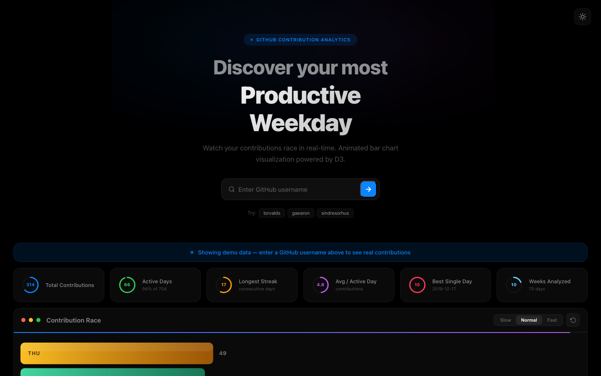
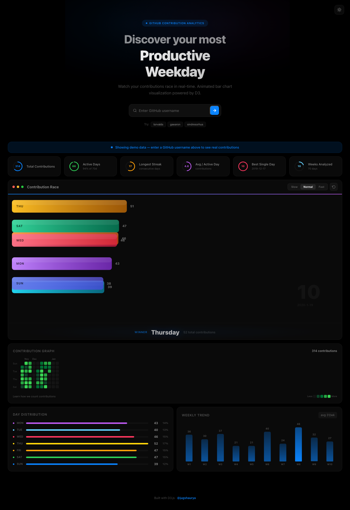

# Productive Weekday

Discover your most productive weekday on GitHub. An animated race bar chart that visualizes your contribution patterns over time using D3.js.

**[Live Demo](https://productive-weekday.netlify.app)** · **[API Server](https://productive-weekday-server.vercel.app)**



## Features

- **Animated Race Chart** — Watch weekdays race as contributions accumulate week by week
- **Speed Control** — Slow, Normal, or Fast animation speeds
- **Stats Dashboard** — Total contributions, active days, longest streak, avg per day, best day
- **Contribution Heatmap** — GitHub-style calendar grid with tooltips
- **Day Distribution** — Breakdown of contributions by weekday with percentages
- **Weekly Trend** — Paginated bar chart of weekly totals
- **Light / Dark Mode** — Toggle between themes
- **Quick Try** — One-click buttons for popular GitHub users (torvalds, gaearon, sindresorhus)
- **Demo Data** — App loads with sample data so you can see the visualization instantly



## Tech Stack

| Layer | Tech |
|-------|------|
| Frontend | React 18, D3.js v7 |
| Backend | Express, Node.js |
| Data | GitHub contribution page scraping (HTML → regex parsing) |
| Deployment | Netlify (client), Vercel (server) |

## How It Works

1. Enter a GitHub username
2. Server fetches contribution pages for each year (joined year → current year)
3. Parses exact contribution counts from `<tool-tip>` elements via regex
4. Returns weekly dataset with date, day, and contribution count
5. Client animates a race bar chart — weekdays accumulate and sort in real-time
6. After the race finishes, the winner is announced

## Run Locally

```bash
# Server
cd visuald3server
npm install
npm run dev          # runs on http://localhost:8080

# Client (separate terminal)
cd client
npm install
npm start            # runs on http://localhost:3000
```

The client automatically hits `localhost:8080` in development and the deployed Vercel server in production (configured via `.env.development` and `.env.production`).

## API

```
GET /user/:username
```

Returns contribution data for the given GitHub user:

```json
{
  "userInfo": {
    "avatar_url": "https://...",
    "name": "Linus Torvalds",
    "username": "torvalds",
    "joinedYear": "2011",
    "joinedDate": "2011-09-03"
  },
  "dataset": {
    "week-1": [
      { "date": "2011-09-03", "day": "Saturday", "contribCount": 5 },
      ...
    ],
    ...
  }
}
```

Responses are cached in-memory for 1 hour per username.

## Project Structure

```
├── client/
│   ├── src/
│   │   ├── components/
│   │   │   ├── App.js              # Main app with theme, search, layout
│   │   │   ├── ShowRacebarGraph.jsx # D3 race bar chart with progress
│   │   │   ├── SingleBar.jsx       # Individual animated bar with gradients
│   │   │   ├── StatsCards.jsx      # Ring progress stat cards
│   │   │   ├── Heatmap.jsx         # GitHub-style contribution grid
│   │   │   ├── DayBreakdown.jsx    # Weekday distribution bars
│   │   │   └── WeeklyTrend.jsx     # Paginated weekly bar chart
│   │   └── assets/
│   │       └── dataset.js          # Default demo dataset
│   ├── .env.development            # localhost server URL
│   └── .env.production             # deployed server URL
│
└── visuald3server/
    ├── server.js                   # Express server with CORS
    ├── api/
    │   ├── getUserInfo.js          # GitHub REST API for user profile
    │   ├── getUserContribDataset.js # Scrape + parse contributions
    │   └── ...
    └── utils/
        └── getDay.js               # Date → weekday name
```

## Credits

- [D3.js](https://d3js.org/) — Data visualization
- [Bar Chart Race (Observable)](https://observablehq.com/@d3/bar-chart-race) — Inspiration
- [unDraw](https://undraw.co/) — Illustrations

Built by [@jugshaurya](https://github.com/jugshaurya)
