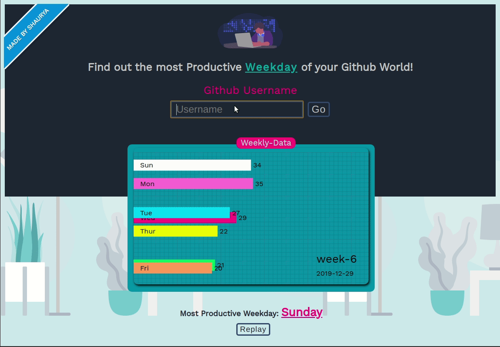

## Productive-Weekday ([Visit Now](https://productive-weekday.netlify.com/))

### Idea

```
To make those racing cars bar-chart of youtube that people make to earn money in excel or tabuleau, but we are goiing to make it using code!!
```

 
 
 

### Goal In Mind

```
1. Find the most productive week day of your github from the day a person joined the github.
2. My Dataset
  a. will be using cheerio to fetch the data of day wise contribution-count from the github page.
  b. Not using github api to fetch users data
3. Tech Stack
  a. React
  b. D3.js (v5)
  c. Dataset week wise
```

---

## Peek a boo!:



## Run client

```
  cd client && yarn start
```

## Run server

```
  cd visuald3server && npm run dev
```

## Wanna Clone?

```
git clone {this repo}
cd client && yarn  && yarn start (one tab)
cd visuald3server && npm i && npm run dev(other tab)

```

### STEPS:

- Get the user data to get the joining date

  1. Get User info + scrapUrls

  - [x] https://api.github.com/users/jugshaurya: (get user joined year)
  - [x] get the year of joining from this let say `yyyy`
  - [x] calculate the diff of yyyy and today year let day `d`

2. Dates are something weird while fetching svg of user contribution for github main page

- [x] Generate the urls in an array to do scrapping later on over each url

  ```
  https://github.com/users/jugshaurya/contributions?from=`yyyy`-12-01&to=``yyyy``-12-31
  - this will give result from `yyyy-1`-12-31 to `yyyy`-12-31

  https://github.com/users/jugshaurya/contributions?from=`yyyy+i`-12-01&to=`yyyy+i`-12-31
  ... for i = 0 to i<=d
  ```

3. generate the dataset from scrapUrls after step 2

- [x] Retrieve the rect tag elements and get date-count and data-date values
- [x] Create a dataset around it and return to front end
- [x] Done!

4. Plot the Result as race bar graph to see the most productive Week Day

- [x] Generate fake data (done using src/utils/gerateRandomData.js) and then :
- [x] Plot Bar graph for one week first
- [x] plot the bar graph for every week every `s` number of seconds; s=1000
- [x] new weekly data will be containing the sum of counts of days from week-1 to week-z; where z is current week pltot number
- [x] Arrange the bars in descending order to arrange the max value bar at the top and min at the bottom
- [x] Smooth the y-position-change, count update, barwidth update.
- [x] Show labels day and count
- [x] Change Bar colors and modify the UI
- [x] show the week near the right bottom corner with date
- [x] show ticks on x and y axis/ Show Grid
- [x] Render Random Data for visuals
- [x] Show user info somewhere
- [x] Display the error toast(#issue2)

#### Deployment

- add a now.json file
- [server](https://productive-weekday-server.jugshaurya.now.sh)
- Add a bulid command and directory to deploy to netlify

### What is D3 ?

- D3 stands for Data-Driven Documents and is widely used to create interactive data visualizations on the web.
- The way most people use D3 with React is to use React to build the structure of the application, and to render traditional HTML elements, and then when it comes to the data visualization section, they pass a DOM container (typically an svg) over to D3 and use D3 to create and destroy and update elements.
  -D3 helps you bring data to life using SVG, Canvas and HTML. D3 combines powerful visualization and interaction techniques with a data-driven approach to DOM manipulation, giving you the full capabilities of modern browsers and the freedom to design the right visual interface for your data.

### Inbetweening or tweening

- is a key process in all types of animation, including computer animation. It is the process of generating intermediate frames between two images, called key frames, to give the appearance that the first image evolves smoothly into the second image.

---

## Thank you

- https://github.com/cheeriojs/cheerio
- https://www.sitepoint.com/best-javascript-charting-libraries/
- https://observablehq.com/@d3/bar-chart-race
- https://observablehq.com/@d3/bar-chart-race-explained
- https://observablehq.com/@johnburnmurdoch/bar-chart-race
- https://github.com/d3/d3
- https://observablehq.com/@d3/bar-chart-race
- [Github Scarping Policy ](https://help.github.com/en/github/site-policy/github-acceptable-use-policies#5-scraping-and-api-usage-restrictions)
- https://www.tutorialsteacher.com/d3js/create-bar-chart-using-d3js
- https://devdocs.io/d3~5/d3-scale#scaleBand
- https://github.com/d3/d3-scale/blob/master/README.md
- https://www.tutorialsteacher.com/d3js/create-svg-chart-in-d3js
- https://www.tutorialsteacher.com/d3js/scales-in-d3
- https://codepen.io/nxworld/pen/oLdoWb
- https://undraw.co/illustrations
- https://favicon.io/favicon-converter/
- https://scotch.io/tutorials/easily-deploy-a-serverless-node-app-with-zeit-now

#### Server

```
https://productive-weekday-server.jugshaurya.now.sh
```

#### Client

```
https://productive-weekday.netlify.com/
```
